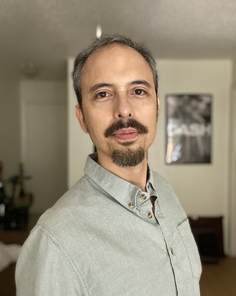

 
João Ozawa is an Assistant Professor in the Department of Communication at the University of North Dakota. He earned his Ph.D. in Journalism and Media from the University of Texas at Austin, where he worked at the Center for Media Engagement.

Ozawa's research focuses on political communication, with a particular emphasis on Latin America and diaspora communities. His work covers topics such as political disinformation, extremism, authoritarian attacks on journalism, and community journalism.

Ozawa primarily uses computational methods and interviews, applying both in mixed-methods research. His computational work involves using R for time series analysis, natural language processing, topic modeling, data visualization, data collection, and general statistical analysis.

With 10 years of professional experience as a journalist, Ozawa has reported on-camera as a Texas correspondent for Globo TV, a major Brazilian media conglomerate and the largest TV network in Latin America. He also spent eight years hosting a Web TV and TV show focused on live music in Brazil.

Feel free to check Ozawa's [CV](Joao Ozawa CV.pdf) or send him an [email](mailto:j.ozawa@utexas.edu).
